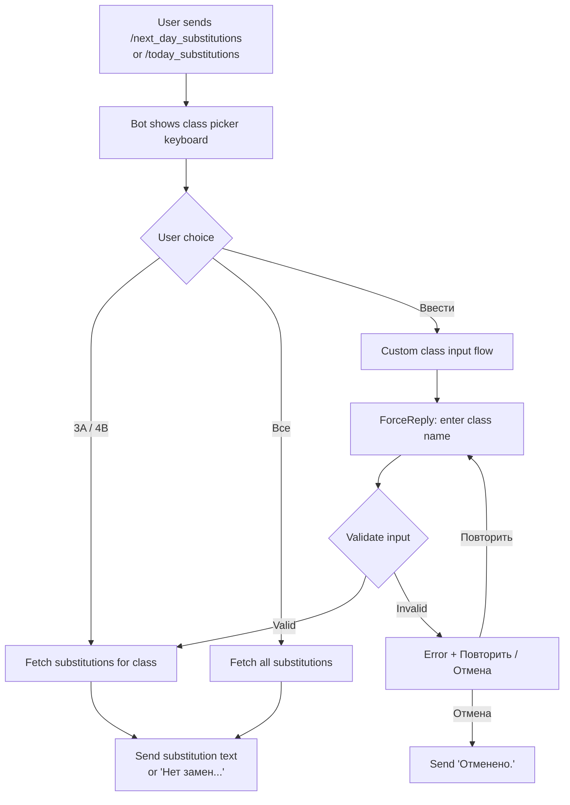
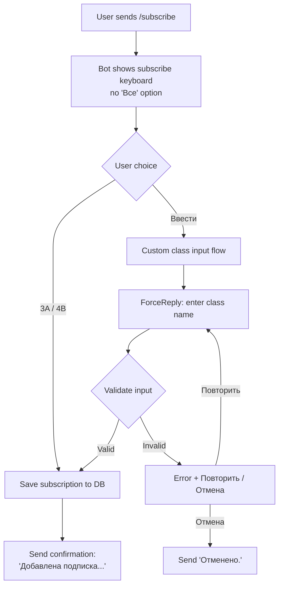
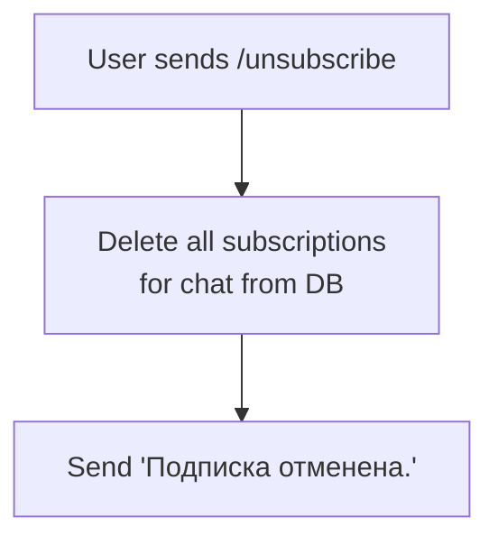
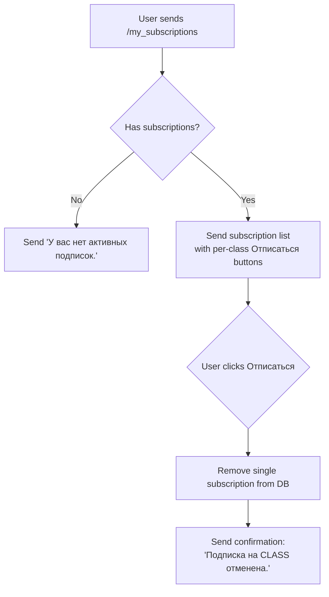
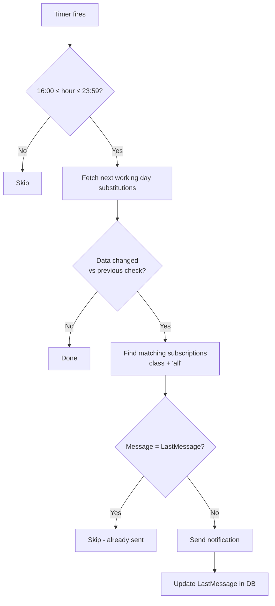

# Telegram Bot Menu Specification

Reverse-engineered specification of the TKVG Substitution Bot menu system.
All user-facing text is in Russian. Substitution data is in Estonian.

## Bot Commands

Registered via Telegram `SetMyCommands` on startup:

| Command | Description (shown in Telegram) |
|---|---|
| `/next_day_substitutions` | Замены на следующий учебный день |
| `/today_substitutions` | Замены на сегодня |
| `/subscribe` | Подписаться на уведомления о заменах |
| `/unsubscribe` | Отписаться от уведомлений |
| `/my_subscriptions` | Мои подписки |

Any unrecognized text triggers either pending class name processing (if awaiting input) or the fallback **Usage** screen.

---

## Screens

### 1. Usage (fallback)

**Trigger:** Any message that is not a recognized command and no pending input awaited.

**Response (HTML):**
```
<b><u>Меню бота</u></b>:
/next_day_substitutions
/today_substitutions
/my_subscriptions
```

Removes any active reply keyboard (`ReplyKeyboardRemove`).

---

### 2. Next Day Substitutions — class picker

**Trigger:** `/next_day_substitutions`

**Prompt:** `Замены на следующий день. Выберите класс:`

**Inline keyboard:**

```
[ 3A ] [ 4B ]
[ Ввести ] [ Все ]
```

| Button label | Callback data |
|---|---|
| 3A | `next_day_substitutions:3.a` |
| 4B | `next_day_substitutions:4.b` |
| Ввести | `enter_class:next_day_substitutions` |
| Все | `next_day_substitutions:all` |

**On button press (3A/4B/Все):** fetches substitutions for the **next working day** (Mon-Fri; Fri/Sat/Sun resolve to Monday). Selecting "Все" returns all classes (no filter).

**On "Ввести" press:** enters [custom class input flow](#6-custom-class-input-flow).

**Result message (plain text):**

With results for a specific class:
```
{yyyy-MM-dd}:
- {period} ({info})
- {period} ({info})
```

With results for all classes ("Все"):
```
{yyyy-MM-dd}:
# {className}:
- {period} ({info})
# {className}:
- {period} ({info})
```

No results:
```
Нет замен на {yyyy-MM-dd} для {className}.
```

---

### 3. Today Substitutions — class picker

**Trigger:** `/today_substitutions`

**Prompt:** `Замены на сегодня. Выберите класс:`

**Inline keyboard:** Same layout as [Screen 2](#2-next-day-substitutions--class-picker).

| Button label | Callback data |
|---|---|
| 3A | `today_substitutions:3.a` |
| 4B | `today_substitutions:4.b` |
| Ввести | `enter_class:today_substitutions` |
| Все | `today_substitutions:all` |

**On button press:** fetches substitutions for **today**. Response format is identical to Screen 2.

---

### 4. Subscribe — class picker

**Trigger:** `/subscribe`

**Prompt:** `Выберите класс:`

**Inline keyboard (no "Все"):**

```
[ 3A ] [ 4B ]
[   Ввести   ]
```

| Button label | Callback data |
|---|---|
| 3A | `add_subscription:3.a` |
| 4B | `add_subscription:4.b` |
| Ввести | `enter_class:add_subscription` |

**On button press:** creates a subscription for the user's chat. Response:
```
Добавлена подписка на замены для 3A. Теперь вы будете получать уведомления о заменах уроков на следующий учебный день.
```

**Subscription rules:**
- A user can hold multiple subscriptions (e.g. `3.a` and `4.b`).
- Duplicate subscriptions are silently ignored.
- DB unique constraint on `(chat_id, class_name)` enforces one subscription per class.

---

### 5. Unsubscribe

**Trigger:** `/unsubscribe`

**Action:** Removes **all** subscriptions for the chat. There is no class picker — it is all-or-nothing.

**Response:**
```
Подписка отменена.
```

---

### 6. Custom Class Input Flow

**Trigger:** User clicks "Ввести" button on any class picker.

**Step 1 — Prompt:**
Bot sends a message with `ForceReply` markup:
```
Введите название класса (например, 3A, 4B, 11C):
```

The operation context (e.g., `next_day_substitutions`) is stored in the in-memory conversation state.

**Step 2 — User enters text:**

- **Valid input** (`\d+[a-zA-Z]` pattern, e.g., "3A", "11c", "4.b"):
  Input is normalized to storage format (e.g., `3.a`) and the original operation is executed.

- **Invalid input:**
  Error message with retry/cancel options:
  ```
  Неверный формат класса: "{input}". Введите в формате: цифра + буква (например, 3A, 4B, 11C).
  [ Повторить ] [ Отмена ]
  ```

  | Button label | Callback data |
  |---|---|
  | Повторить | `retry_input:{operation}` |
  | Отмена | `cancel_input` |

  - **Повторить:** Re-sends the ForceReply prompt.
  - **Отмена:** Clears pending state, sends "Отменено."

---

### 7. My Subscriptions

**Trigger:** `/my_subscriptions`

**No subscriptions:**
```
У вас нет активных подписок.
```

**With subscriptions — message + per-class unsubscribe buttons:**
```
Ваши подписки:
- 3A
- 4B
[ Отписаться 3A ] [ Отписаться 4B ]
```

Each button has callback data `remove_subscription:{className}` (e.g., `remove_subscription:3.a`).

**On unsubscribe button press:** Removes that single subscription and sends confirmation:
```
Подписка на 3A отменена.
```

---

## Class Name Normalization

| Context | Format | Examples |
|---|---|---|
| Storage (DB) | `{digits}.{lowercase letter}` | `3.a`, `4.b`, `11.c` |
| Display (Telegram UI) | `{digits}{uppercase letter}` | `3A`, `4B`, `11C` |
| User input | `\d+[a-zA-Z]` (dot optional) | `3A`, `3a`, `3.a`, `11C` |

Conversion: `ClassNameUtils.Normalize()` and `ClassNameUtils.ToDisplayFormat()`.

---

## Callback Query Protocol

All inline keyboard presses go through a single callback handler.

### Callback data formats

| Pattern | Description |
|---|---|
| `{operation}:{className}` | Class selection (query or subscribe) |
| `enter_class:{operation}` | Start custom class input |
| `retry_input:{operation}` | Retry after invalid input |
| `cancel_input` | Cancel custom input |
| `remove_subscription:{className}` | Remove a single subscription |

### Operations

| Operation | Description |
|---|---|
| `next_day_substitutions` | Query next working day |
| `today_substitutions` | Query today |
| `add_subscription` | Add a subscription |

### Processing

1. If data is `cancel_input` — clear pending state, send "Отменено.", stop.
2. Validate data contains `:` separator. If not — respond `"Invalid callback data"` and stop.
3. Immediately acknowledge with `AnswerCallbackQuery("Processing...")`.
4. Split on `:` to extract operation and payload.
5. Route by operation prefix — see callback data formats above.
6. For query operations: `"all"` is converted to `null` (no class filter).
7. For `add_subscription`: class name is passed as-is.

---

## Inline Keyboard Builder

`ClassPickerKeyboardMarkup` provides two keyboard variants:

**`GetClassPickerKeyboard(command)`** — for query flows:
```
Row 1:  [ "3A" → {command}:3.a ]  [ "4B" → {command}:4.b ]
Row 2:  [ "Ввести" → enter_class:{command} ]  [ "Все" → {command}:all ]
```

**`GetSubscribeClassPickerKeyboard(command)`** — for subscribe flow:
```
Row 1:  [ "3A" → {command}:3.a ]  [ "4B" → {command}:4.b ]
Row 2:  [ "Ввести" → enter_class:{command} ]
```

---

## Conversation State

Custom class input requires a two-step interaction (prompt → user reply). State is managed by `ConversationStateService` — a singleton `ConcurrentDictionary<long, string>` mapping `chatId → operation`.

- **Set** when user clicks "Ввести" or "Повторить".
- **Consumed** when the next free-text message arrives from that chat.
- **Cleared** when user clicks "Отмена" or sends a recognized command.
- **Transient** — lost on application restart (acceptable; user re-clicks the button).

---

## Background Notifications

Subscribers receive automatic notifications when substitution data changes.

### Schedule

- Runs on a configurable interval (`SubstitutionsCheckPeriod`).
- **Active window:** 16:00 – 23:59 only. Checks outside this window are skipped.

### Logic

1. Fetch substitutions for the next working day.
2. Compare each class's data against the previous check (held in memory).
3. For each class with changed data:
   - Find all subscriptions matching the class (including `all` subscribers and `{class}_ring` variant).
   - Render a notification message.
   - Skip sending if the message is identical to `LastMessage` on the subscription (deduplication).
   - Send the message and update `LastMessage`.

### Notification message format

```
Замены {className} {date}:
- {period} ({info})
- {period} ({info})
```

---

## Data Model

### SubscriptionEntity

| Field | Type | Description |
|---|---|---|
| `Id` | int | Primary key |
| `ChatId` | long | Telegram chat ID |
| `ClassName` | string | `"3.a"`, `"4.b"`, or `"all"` |
| `LastMessage` | string | Last sent notification text (for dedup) |
| `CreatedAt` | DateTime | UTC timestamp of subscription creation |

Stored in PostgreSQL table `subscriptions`. Unique constraint on `(chat_id, class_name)`.

---

## Flow Diagrams

### Query flow (today / next day)



### Subscribe flow



### Unsubscribe flow



### My subscriptions flow



### Background notification flow


